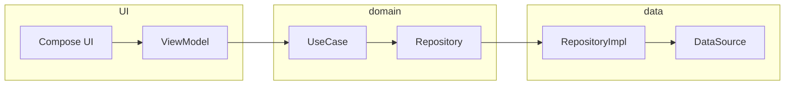
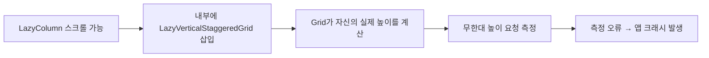

# 🖼️Prography

> Unsplash API를 기반으로한 최신, 랜덤이미지를 제공하고
 다운로드와 북마크 기능을 제공하는 이미지 뷰어 앱

# 📖개요

> Prography는 Jetpack Compose 학습과 이미지 서비스 제공을 위해 필요한 기술들을 학습하기 위해 설계된 앱입니다.

**🗓️ 기간**: 2025.02.12 ~ 2025.02.21

**👥 인원**: 개인 프로젝트 (Prography 동아리 디자인 제공)

**🎯 목적**
- 완전한 Compose UI 기반 앱 개발
- MVVM + Clean Architecture 패턴 적용 
- Room, Retrofit, Coil, Hilt 등 Android 최신 라이브러리 학습
- 새로 습득한 기술 적용하며 학습

 

# 📱주요 기능

| 기능 | 설명 |
| --- | --- |
| 최신 이미지 | 최신 이미지 목록 조회, StaggeredGrid 기반 그리드 UI |
| 랜덤 이미지 | Unsplash 랜덤 API 기반 이미지 제공 |
| 이미지 상세 | 이미지 메타데이터, 다운로드, 북마크 기능 제공 |
| 이미지 다운로드 | Android 9 이하 & 10 이상 정책 분리, MediaStore 대응 |
| 북마크 | 로컬 DB(Room) 기반 저장 및 조회 |
| 무한 스크롤 | 스크롤 최하단 도달 시 추가 데이터 로드 |
| Skeleton UI | 이미지 로딩 단계에서 그리드 형태 Skeleton 표시 |

 

# 🛠기술 스택

| 카테고리 | 기술 |
| --- | --- |
| **언어** | Kotlin |
| **UI** | Jetpack Compose |
| **아키텍처** | MVVM, Clean Architecture |
| **네트워크** | Retrofit2, OkHttp3 |
| **다운로드** | MediaStore |
| **이미지 로딩** | Coil |
| **의존성 주입** | Hilt |
| **데이터베이스** | Room |
| **네비게이션** | Compose Navigation |
| **비동기 처리** | Coroutine, Flow |

 

# 🔍기술 선택 이유

### Jetpack Compose
- Android 개발의 트렌드가 점차 선언형 UI 로 바뀌므로 그에 맞춰 학습 
- List 와 Grid 를 섞은 복합 스크롤 레이아웃이 많고, 재사용하는 컴포저블도 많음
- 선언형 UI 로 구현이 쉽고 빠르며 UI 상태 변화 추적도 쉬워져 오류 감소

### Retrofit2 + OkHttp3
- Unsplash API 호출에 헤더, 인터셉터, 쿼리 등을 제어하기 쉬움
- Retrofit2 + OkHttp3 를 함께 사용해 이미지 다운로드 기능 구현
- Coroutine 지원으로 비동기 처리 및 가독성 향상

### Coil
- Glide 보다 Compose 환경에서 Recomposition 성능이 안정적
- 추후 이미지 캐싱을 적용 시 메모리 캐싱, 디스크 캐싱 모두 제공

### Hilt
- Retrofit, Room, Repository 등 다양한 의존성을 관리해야 하므로 DI 사용이 유리
- 다른 DI 프레임워크보다 코드 작성량이 적은편이며, Android 공식 가이드라인이 있어 첫 학습에 좋음

### Other
- **MediaStore**: Android 10 이상 Scoped Storage 정책 대응해 갤러리에 이미지가 보이도록 설정
- **Room**: 이미지 북마크 저장용으로 로컬 영구 저장소 필요, Flow 로 반영이 빠름 

 

# 🧱아키텍처

- Prography는 MVP로 빠르게 UI 와 기능 개발, 이후 API 호출과 상태가 복잡해지며 계층 분리의 필요성이 생김
- UI, Domain, Data 계층을 분리해 단방향 데이터 흐름을 유지
- 이미지 요청, 에러 처리등 비즈니스 로직 `Domain` 계층으로 분리
- 네트워크를 통한 이미지 다운로드 로직은 `Data` 계층으로 분리
- `UI` 에서는 UiState만 구독해 깜빡임이나 중복 호출 예방

 

# 🎯트러블슈팅

### 1. Android 10 이상에서 다운로드 된 이미지가 안보이는 문제

- Android 9 이하와 10 이상에서 파일 저장 방식 차이로 다운로드가 성공해도 갤러리에 보이지 않음
- Android 10 이상에서는 MediaStore 를 사용해서 저장해야 갤러리 앱에서 정상적으로 인식됨
- 버전 별 분기 처리 + `IS_PENDING` 으로 다운로드 상태 적용해 해결

[🔗 자세히 보기](https://uihyeonkim.notion.site/Android-10-2bf5686b194380fa84c2fcb8dfa06f88?source=copy_link)

---

### 2. OuterScroll + NestedScroll 조합 레이아웃에서 크래시가 나던 문제

- 화면 전체 스크롤 레이아웃에 내부 Grid 스크롤 레이아웃을 넣어 무한 높이 측정 크래시 발생
- Grid의 내부 스크롤 제거해 상위 스크롤만 사용 + `heightIn()`으로 최대 높이 고정

[🔗 자세히 보기](https://uihyeonkim.notion.site/Scroll-NestedScroll-2bf5686b19438062a48bcf4de2c0cce4?source=copy_link)

 

# 📷주요 화면 스크린샷

 

# 🚀향후 개선 계획
- 이미지 메모리, 디스크 캐싱 적용
- 테스트 코드 추가
- 검색 기능 추가 고려

<!--
## 📱How To Use
1. [Unsplash developer](https://unsplash.com/developers) 회원가입 및 로그인
2. [귀하의 앱 -> New Application] 에서 access key 발급
3. 앱의 local.properties 에 `Unsplash_Api_Key="access key"` 작성
-->
