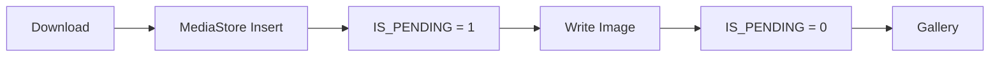
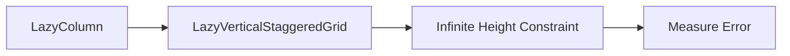
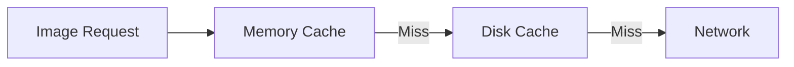
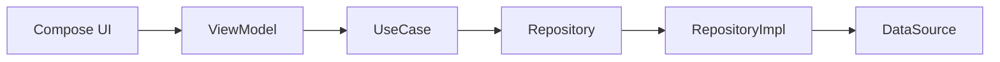

<div align="center">

# 🖼️ Prography

**Unsplash 기반 이미지 탐색 Android 앱**

최신·랜덤 이미지를 탐색하고,<br/>
마음에 드는 이미지를 북마크하거나 기기에 저장할 수 있습니다.


</div>

---

## Product Experience


| Explore | Save | Bookmark |
| --- | --- | --- |
| 최신·랜덤 이미지를 탐색합니다. | 원본 이미지를 기기에 저장합니다. | Room에 관심 이미지를 보관합니다. |
| Staggered Grid · Paging | MediaStore | Room · Flow |

---

# Features

- Unsplash 최신 이미지
- Random Image
- 이미지 상세 정보
- Staggered Grid
- Infinite Scroll
- 이미지 다운로드
- Room Bookmark
- Skeleton / Error / Retry UI
- Memory / Disk Image Cache

---

# Engineering Highlights

## 01. 다운로드는 성공했는데 갤러리에 이미지가 없다

Android 10부터 Scoped Storage 정책이 적용되면서
파일 경로에 직접 이미지를 저장하는 기존 방식만으로는
Gallery에서 정상적으로 표시되지 않을 수 있습니다.


```mermaid
flowchart LR
    A["Download"]
    B["MediaStore Insert"]
    C["IS_PENDING = 1"]
    D["Write Image"]
    E["IS_PENDING = 0"]
    F["Gallery"]

    A --> B --> C --> D --> E --> F
```

Android 10 이상에서는 MediaStore에 먼저 항목을 만들고:

```kotlin
put(
    MediaStore.Images.Media.IS_PENDING,
    1,
)
```

파일 기록이 끝난 뒤 공개 상태로 변경합니다.

Android 버전에 따라 파일 저장 정책을 분리해
저장된 이미지가 시스템 Gallery에서도 정상적으로 인식되도록 처리했습니다.

---

## 02. LazyColumn 안에 StaggeredGrid를 넣었더니 크래시가 발생했다

화면 전체를 `LazyColumn`으로 만들고
그 안에 `LazyVerticalStaggeredGrid`를 배치하면서 측정 오류가 발생했습니다.


```mermaid
flowchart LR
    A["LazyColumn"]
    B["LazyVerticalStaggeredGrid"]
    C["Infinite Height Constraint"]
    D["Measure Error"]

    A --> B --> C --> D
```

두 개의 vertical scroll container가
동시에 자신의 높이를 계산하려고 한 것이 원인이었습니다.

내부 Grid의 자체 스크롤을 제거하고
상위 Scroll Container가 전체 스크롤을 담당하도록 변경했습니다.

```text
Before

LazyColumn
└── Scrollable Grid


After

LazyColumn
└── Non-scrollable Grid
```

Grid에는 명시적인 높이 제약을 적용해
무한대 높이로 측정되는 것도 방지했습니다.

---

## 03. 스크롤 위치를 상태처럼 계속 확인하지 않기

Infinite Scroll은 `snapshotFlow`로
실제 Scroll State의 변화를 관찰합니다.

```text
LazyGridState
     ↓
snapshotFlow
     ↓
마지막 visible item
     ↓
다음 페이지 요청
```

Compose의 일반 recomposition과
Pagination 조건 확인을 분리해 추가 요청 시점을 관리합니다.

---

## 04. 이미지 앱에서 Network 요청보다 Cache가 먼저

현재 프로젝트에서는 Coil의 Memory / Disk Cache를 구성하고,
HTTP Cache 정책도 함께 사용합니다.


```mermaid
flowchart LR
    A["Image Request"]
    B["Memory Cache"]
    C["Disk Cache"]
    D["Network"]

    A --> B
    B -->|Miss| C
    C -->|Miss| D
```

초기 README에서 향후 계획으로 남겨두었던 이미지 Cache는
현재 구현에 반영되어 있습니다.

---

# Architecture


```mermaid
flowchart LR
    UI["Compose UI"]
    VM["ViewModel"]
    UC["UseCase"]
    REPO["Repository"]
    IMPL["RepositoryImpl"]
    DS["DataSource"]

    UI --> VM --> UC --> REPO --> IMPL --> DS
```

프로젝트 초기에는 화면에서 API 호출을 직접 다루던 부분도 있었지만,
기능이 늘면서 DataSource / Repository / UseCase 경계를 분리했습니다.

---

# Quality

핵심 데이터·상태 처리에는 Unit Test를 추가했고,
오류 화면과 Retry 흐름도 기능에 포함되어 있습니다.

단순한 초기 학습 프로젝트를 그대로 두기보다
프로젝트 종료 이후에도 Cache, Test, Error handling 등을 보완했습니다.

---

# Tech Stack

| Area | Stack |
| --- | --- |
| Language | Kotlin |
| UI | Jetpack Compose |
| Architecture | MVVM · Clean Architecture |
| Network | Retrofit · OkHttp |
| API | Unsplash |
| Image | Coil |
| Download | MediaStore |
| Local | Room |
| DI | Hilt |
| Async | Coroutines · Flow |

---

# Project

| | |
| --- | --- |
| Initial Development | 2025.02.12 ~ 2025.02.21 |
| Type | Individual Android Project |
| Design | Prography 제공 |
| Maintenance | 이후 구조 개선 및 기능 보완 |

---

<div align="center">

**Explore, save, and revisit images with Compose.**

</div>
